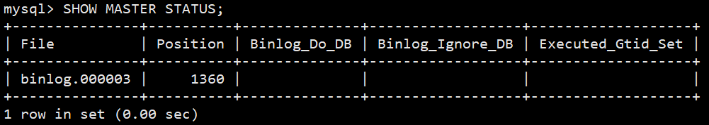
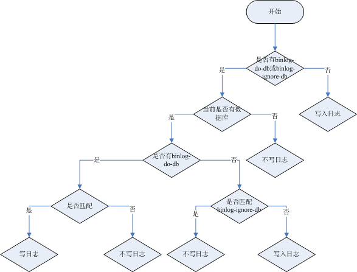
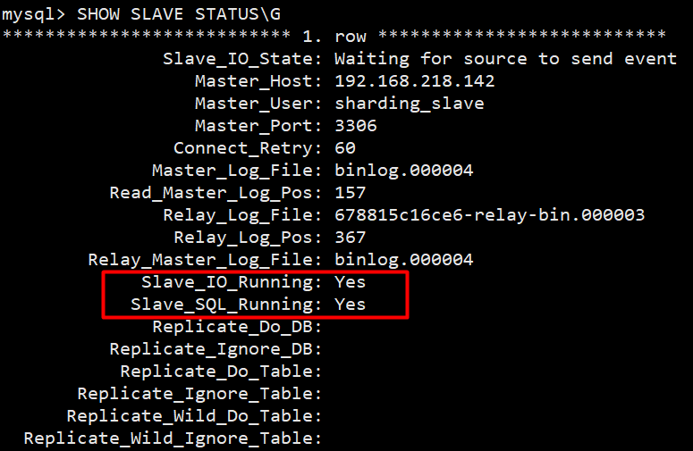

# jdbc-cluster
## Docker
```shell
yum install -y yum-utils device-mapper-persistent-data  lvm2
yum-config-manager --add-repo http://mirrors.aliyun.com/docker-ce/linux/centos/docker-ce.repo
yum install -y docker-ce
systemctl start docker
docker version
```
```shell
#查看服务是否自动启动（是：enabled | 否：disabled）
systemctl list-unit-files|grep docker.service 

#设置开机启动：如不是enabled可以运行如下命令设置自启动
systemctl enable docker
#重新加载服务配置
systemctl daemon-reload 
```
```shell
如果此时防火墙是开启的，`则先关闭防火墙，并重启docker`，否则后续安装的MySQL无法启动

#关闭docker
systemctl stop docker
#关闭防火墙
systemctl stop firewalld
#启动docker
systemctl start docker
```
## 读写分离
### MySQL 主服务器
```shell
docker run -d \
-p 3306:3306 \
-v /sharding/mysql/master/conf:/etc/mysql/conf.d \
-v /sharding/mysql/master/data:/var/lib/mysql \
-e MYSQL_ROOT_PASSWORD=123456 \
--name sharding-mysql-master \
mysql:8.0.29
```
```shell
vim /sharding/mysql/master/conf/my.cnf

# --- 文件里面内容开始 ---
[mysqld]
# 服务器唯一id，默认值1
server-id=1
# 设置日志格式，默认值ROW
binlog_format=ROW
# --- 文件里面内容结束 ---

docker restart sharding-mysql-master
```
```shell
#进入容器：env LANG=C.UTF-8 避免容器中显示中文乱码
docker exec -it sharding-mysql-master env LANG=C.UTF-8 /bin/bash
#进入容器内的mysql命令行
mysql -uroot -p

# mysql5.7 的默认密码校验方式是 mysql_native_password
# mysql8.0 的默认密码校验方式是 caching_sha2_password
# 修改默认密码校验方式
ALTER USER 'root'@'%' IDENTIFIED WITH mysql_native_password BY '123456';
```
```sql
-- 创建slave用户
CREATE USER 'sharding_slave'@'%';
-- 设置密码
ALTER USER 'sharding_slave'@'%' IDENTIFIED WITH mysql_native_password BY '123456';
-- 授予复制权限
GRANT REPLICATION SLAVE ON *.* TO 'sharding_slave'@'%';
-- 刷新权限
FLUSH PRIVILEGES;
```
```sql
-- 查询master状态
SHOW MASTER STATUS;
```

> binlog.000003     1360

### MySQL my.cnf 参数解释
```powershell
[mysqld]
# 服务器唯一id，默认值1
server-id=1
# 设置日志格式，默认值ROW
binlog_format=STATEMENT
# 二进制日志名，默认binlog
# log-bin=binlog
# 设置需要复制的数据库，默认复制全部数据库
#binlog-do-db=mytestdb
# 设置不需要复制的数据库
#binlog-ignore-db=mysql
#binlog-ignore-db=infomation_schema
```
#### binlog格式说明

- binlog_format=STATEMENT：日志记录的是主机数据库的写指令，性能高，但是now()之类的函数以及获取系统参数的操作会出现主从数据不同步的问题。
- binlog_format=ROW（默认）：日志记录的是主机数据库的写后的数据，批量操作时性能较差，解决now()或者 user()或者 @@hostname 等操作在主从机器上不一致的问题。
- binlog_format=MIXED：是以上两种level的混合使用，有函数用ROW，没函数用STATEMENT，但是无法识别系统变量
#### binlog-ignore-db和binlog-do-db的优先级问题

### MySQL 从服务器1
```shell
docker run -d \
-p 3307:3306 \
-v /sharding/mysql/slave1/conf:/etc/mysql/conf.d \
-v /sharding/mysql/slave1/data:/var/lib/mysql \
-e MYSQL_ROOT_PASSWORD=123456 \
--name sharding-mysql-slave1 \
mysql:8.0.29
```
```shell
vim /sharding/mysql/slave1/conf/my.cnf

# --- 文件里面内容开始 ---
[mysqld]
# 服务器唯一id，每台服务器的id必须不同，如果配置其他从机，注意修改id
server-id=2
# 中继日志名，默认xxxxxxxxxxxx-relay-bin
#relay-log=relay-bin
# --- 文件里面内容结束 ---

docker restart sharding-mysql-slave1
```
```shell
#进入容器：
docker exec -it sharding-mysql-slave1 env LANG=C.UTF-8 /bin/bash
#进入容器内的mysql命令行
mysql -uroot -p
#修改默认密码校验方式
ALTER USER 'root'@'%' IDENTIFIED WITH mysql_native_password BY '123456';
```
```sql
--  MASTER IP
CHANGE MASTER TO MASTER_HOST='192.168.218.142', 
-- MASTER 中创建的slave用户
MASTER_USER='sharding_slave',MASTER_PASSWORD='123456', MASTER_PORT=3306,
-- MASTER 执行 SHOW MASTER STATUS; 获取
MASTER_LOG_FILE='binlog.000003',MASTER_LOG_POS=1360;
```
### MySQL 从服务器2
```shell
docker run -d \
-p 3308:3306 \
-v /sharding/mysql/slave2/conf:/etc/mysql/conf.d \
-v /sharding/mysql/slave2/data:/var/lib/mysql \
-e MYSQL_ROOT_PASSWORD=123456 \
--name sharding-mysql-slave2 \
mysql:8.0.29
```
```shell
vim /sharding/mysql/slave2/conf/my.cnf

# --- 文件里面内容开始 ---
[mysqld]
# 服务器唯一id，每台服务器的id必须不同，如果配置其他从机，注意修改id
server-id=3
# 中继日志名，默认xxxxxxxxxxxx-relay-bin
#relay-log=relay-bin
# --- 文件里面内容结束 ---

docker restart sharding-mysql-slave2
```
```shell
#进入容器：
docker exec -it sharding-mysql-slave2 env LANG=C.UTF-8 /bin/bash
#进入容器内的mysql命令行
mysql -uroot -p
#修改默认密码校验方式
ALTER USER 'root'@'%' IDENTIFIED WITH mysql_native_password BY '123456';
```
```sql
--  MASTER IP
CHANGE MASTER TO MASTER_HOST='192.168.218.142', 
-- MASTER 中创建的slave用户
MASTER_USER='sharding_slave',MASTER_PASSWORD='123456', MASTER_PORT=3306,
-- MASTER 执行 SHOW MASTER STATUS; 获取
MASTER_LOG_FILE='binlog.000003',MASTER_LOG_POS=1360;
```
### 启动主从同步
```sql
START SLAVE;
-- 查看状态（不需要分号） \G: 纵向输出
SHOW SLAVE STATUS\G
```

```sql
CREATE DATABASE db_user;
USE db_user;
CREATE TABLE t_user (
 id BIGINT AUTO_INCREMENT,
 uname VARCHAR(30),
 PRIMARY KEY (id)
);
INSERT INTO t_user(uname) VALUES('zhang3');
INSERT INTO t_user(uname) VALUES(@@hostname);
```
### YAML 配置文件
```yaml
server:
  port: 8888
# 应用名称
spring:
  application:
    name: jdbc-cluster
  # 开发环境设置
  profiles:
    active: dev
  # 模式配置
  shardingsphere:
    mode:
      type: Cluster
      repository:
        type: ZooKeeper
        props:
          namespace: governance
          server-lists: localhost:6181
          retryIntervalMilliseconds: 500
          timeToLiveSeconds: 60
    datasource:
      # 真实数据源名称，多个数据源用逗号区分
      names: master,slave1,slave2
      master:
        # 数据库连接池全类名
        type: com.zaxxer.hikari.HikariDataSource
        # 数据库驱动类名，以数据库连接池自身配置为准
        driver-class-name: com.mysql.jdbc.Driver
        # 数据库 URL 连接，以数据库连接池自身配置为准
        jdbc-url: jdbc:mysql://192.168.218.142:3306/db_user
        # 数据库用户名，以数据库连接池自身配置为准
        username: root
        # 数据库密码，以数据库连接池自身配置为准
        password: 123456
      slave1:
        type: com.zaxxer.hikari.HikariDataSource
        driver-class-name: com.mysql.jdbc.Driver
        jdbc-url: jdbc:mysql://192.168.218.142:3307/db_user
        username: root
        password: 123456
      slave2:
        type: com.zaxxer.hikari.HikariDataSource
        driver-class-name: com.mysql.jdbc.Driver
        jdbc-url: jdbc:mysql://192.168.218.142:3308/db_user
        username: root
        password: 123456
    rules:
      readwrite-splitting:
        data-sources:
          readwrite_ds:
            # 静态读写分离(static-strategy)
            static-strategy:
              # 写库数据源名称
              write-data-source-name: master
              # 读库数据源列表，多个从数据源用逗号分隔
              read-data-source-names: slave1,slave2
            # 负载均衡算法名称
            load-balancer-name: alg_round_robin
        # 负载均衡算法配置
        load-balancers:
          alg_weight:
            # 负载均衡算法类型
            type: WEIGHT
            # 负载均衡算法属性配置
            props:
              slave1: 1.5
              slave2: 3
          alg_round_robin:
            # 负载均衡算法类型
            type: ROUND_ROBIN
          alg_random:
            # 负载均衡算法类型
            type: RANDOM
    # 打印SQl
    props:
      sql-show: true
```
## 垂直分片
### MySQL 服务器
```shell
docker run -d \
-p 3301:3306 \
-v /sharding/server/user/conf:/etc/mysql/conf.d \
-v /sharding/server/user/data:/var/lib/mysql \
-e MYSQL_ROOT_PASSWORD=123456 \
--name server-user \
mysql:8.0.29
```
```shell
#进入容器：
docker exec -it server-user env LANG=C.UTF-8 /bin/bash
#进入容器内的mysql命令行
mysql -uroot -p
#修改默认密码插件
ALTER USER 'root'@'%' IDENTIFIED WITH mysql_native_password BY '123456';
```
```sql
CREATE DATABASE db_user;
USE db_user;
CREATE TABLE t_user (
 id BIGINT AUTO_INCREMENT,
 uname VARCHAR(30),
 PRIMARY KEY (id)
);
```
```shell
docker run -d \
-p 3302:3306 \
-v /sharding/server/order/conf:/etc/mysql/conf.d \
-v /sharding/server/order/data:/var/lib/mysql \
-e MYSQL_ROOT_PASSWORD=123456 \
--name server-order \
mysql:8.0.29
```
```shell
#进入容器：
docker exec -it server-order env LANG=C.UTF-8 /bin/bash
#进入容器内的mysql命令行
mysql -uroot -p
#修改默认密码插件
ALTER USER 'root'@'%' IDENTIFIED WITH mysql_native_password BY '123456';
```
```sql
CREATE DATABASE db_order;
USE db_order;
CREATE TABLE t_order (
  id BIGINT AUTO_INCREMENT,
  order_no VARCHAR(30),
  user_id BIGINT,
  amount DECIMAL(10,2),
  PRIMARY KEY(id) 
);
```
### YAML 配置文件
```yaml
server:
  port: 8888
# 应用名称
spring:
  application:
    name: jdbc-cluster
  # 开发环境设置
  profiles:
    active: dev
  # 模式配置
  shardingsphere:
    mode:
      type: Cluster
      repository:
        type: ZooKeeper
        props:
          namespace: governance
          server-lists: localhost:6181
          retryIntervalMilliseconds: 500
          timeToLiveSeconds: 60
    datasource:
      # 真实数据源名称，多个数据源用逗号区分
      names: server-user,server-order
      server-user:
        # 数据库连接池全类名
        type: com.zaxxer.hikari.HikariDataSource
        # 数据库驱动类名，以数据库连接池自身配置为准
        driver-class-name: com.mysql.jdbc.Driver
        # 数据库 URL 连接，以数据库连接池自身配置为准
        jdbc-url: jdbc:mysql://192.168.218.142:3301/db_user
        # 数据库用户名，以数据库连接池自身配置为准
        username: root
        # 数据库密码，以数据库连接池自身配置为准
        password: 123456
      server-order:
        type: com.zaxxer.hikari.HikariDataSource
        driver-class-name: com.mysql.jdbc.Driver
        jdbc-url: jdbc:mysql://192.168.218.142:3302/db_order
        username: root
        password: 123456
    rules:
      # 标准分片表配置
      sharding:
        tables:
          t_user:
            # 由数据源名 + 表名组成，以小数点分隔。多个表以逗号分隔，支持 inline 表达式。缺省表示使用已知数据源与逻辑表名称生成数据节点，用于广播表（即每个库中都需要一个同样的表用于关联查询，多为字典表）或只分库不分表且所有库的表结构完全一致的情况
            actual-data-nodes: server-user.t_user
          t_order:
            actual-data-nodes: server-order.t_order
    # 打印SQl
    props:
      sql-show: true
```
## 水平分片
### MySQL 服务器
```shell
docker run -d \
-p 3310:3306 \
-v /sharding/server/order0/conf:/etc/mysql/conf.d \
-v /sharding/server/order0/data:/var/lib/mysql \
-e MYSQL_ROOT_PASSWORD=123456 \
--name server-order0 \
mysql:8.0.29
```
```shell
#进入容器：
docker exec -it server-order0 env LANG=C.UTF-8 /bin/bash
#进入容器内的mysql命令行
mysql -uroot -p
#修改默认密码插件
ALTER USER 'root'@'%' IDENTIFIED WITH mysql_native_password BY '123456';
```
```sql
CREATE DATABASE db_order;
USE db_order;
CREATE TABLE t_order0 (
  id BIGINT,
  order_no VARCHAR(30),
  user_id BIGINT,
  amount DECIMAL(10,2),
  PRIMARY KEY(id) 
);
CREATE TABLE t_order1 (
  id BIGINT,
  order_no VARCHAR(30),
  user_id BIGINT,
  amount DECIMAL(10,2),
  PRIMARY KEY(id) 
);

CREATE TABLE t_order_item0(
    id BIGINT,
    order_no VARCHAR(30),
    user_id BIGINT,
    price DECIMAL(10,2),
    `count` INT,
    PRIMARY KEY(id)
);
CREATE TABLE t_order_item1(
    id BIGINT,
    order_no VARCHAR(30),
    user_id BIGINT,
    price DECIMAL(10,2),
    `count` INT,
    PRIMARY KEY(id)
);
```
```shell
docker run -d \
-p 3311:3306 \
-v /sharding/server/order1/conf:/etc/mysql/conf.d \
-v /sharding/server/order1/data:/var/lib/mysql \
-e MYSQL_ROOT_PASSWORD=123456 \
--name server-order1 \
mysql:8.0.29
```
```shell
#进入容器：
docker exec -it server-order1 env LANG=C.UTF-8 /bin/bash
#进入容器内的mysql命令行
mysql -uroot -p
#修改默认密码插件
ALTER USER 'root'@'%' IDENTIFIED WITH mysql_native_password BY '123456';
```
```sql
CREATE DATABASE db_order;
USE db_order;
CREATE TABLE t_order0 (
  id BIGINT,
  order_no VARCHAR(30),
  user_id BIGINT,
  amount DECIMAL(10,2),
  PRIMARY KEY(id) 
);
CREATE TABLE t_order1 (
  id BIGINT,
  order_no VARCHAR(30),
  user_id BIGINT,
  amount DECIMAL(10,2),
  PRIMARY KEY(id) 
);

CREATE TABLE t_order_item0(
    id BIGINT,
    order_no VARCHAR(30),
    user_id BIGINT,
    price DECIMAL(10,2),
    `count` INT,
    PRIMARY KEY(id)
);
CREATE TABLE t_order_item1(
    id BIGINT,
    order_no VARCHAR(30),
    user_id BIGINT,
    price DECIMAL(10,2),
    `count` INT,
    PRIMARY KEY(id)
);
```
### YAML 配置文件 (水平分片+关联表)
```yaml
server:
  port: 8888
# 应用名称
spring:
  application:
    name: jdbc-cluster
  # 开发环境设置
  profiles:
    active: dev
  # 模式配置
  shardingsphere:
    mode:
      type: Cluster
      repository:
        type: ZooKeeper
        props:
          namespace: governance
          server-lists: localhost:6181
          retryIntervalMilliseconds: 500
          timeToLiveSeconds: 60
    datasource:
      # 真实数据源名称，多个数据源用逗号区分
      names: server-user,server-order0,server-order1
      server-user:
        # 数据库连接池全类名
        type: com.zaxxer.hikari.HikariDataSource
        # 数据库驱动类名，以数据库连接池自身配置为准
        driver-class-name: com.mysql.jdbc.Driver
        # 数据库 URL 连接，以数据库连接池自身配置为准
        jdbc-url: jdbc:mysql://192.168.218.142:3301/db_user
        # 数据库用户名，以数据库连接池自身配置为准
        username: root
        # 数据库密码，以数据库连接池自身配置为准
        password: 123456
      server-order0:
        type: com.zaxxer.hikari.HikariDataSource
        driver-class-name: com.mysql.jdbc.Driver
        jdbc-url: jdbc:mysql://192.168.218.142:3310/db_order
        username: root
        password: 123456
      server-order1:
        type: com.zaxxer.hikari.HikariDataSource
        driver-class-name: com.mysql.jdbc.Driver
        jdbc-url: jdbc:mysql://192.168.218.142:3311/db_order
        username: root
        password: 123456
    rules:
      # 标准分片表配置
      sharding:
        tables:
          t_user:
            # 由数据源名 + 表名组成，以小数点分隔。多个表以逗号分隔，支持 inline 表达式。
            # 缺省表示使用已知数据源与逻辑表名称生成数据节点，用于广播表（即每个库中都需要一个同样的表用于关联查询，多为字典表）或只分库不分表且所有库的表结构完全一致的情况
            actual-data-nodes: server-user.t_user
          t_order:
            actual-data-nodes: server-order$->{0..1}.t_order$->{0..1}
            # 分库策略
            database-strategy:
              standard:
                sharding-column: user_id
                sharding-algorithm-name: alg_mod
            # 分表策略
            table-strategy:
              standard:
                # 分片列名称
                sharding-column: order_no
                # 分片算法名称
                sharding-algorithm-name: alg_hash_mod
            # 分布式序列策略配置
            key-generate-strategy:
              column: id
              key-generator-name: alg_snowflake
          t_order_item:
            actual-data-nodes: server-order$->{0..1}.t_order_item$->{0..1}
            # 分库策略
            database-strategy:
              standard:
                sharding-column: user_id
                sharding-algorithm-name: alg_mod
            # 分表策略
            table-strategy:
              standard:
                # 分片列名称
                sharding-column: order_no
                # 分片算法名称
                sharding-algorithm-name: alg_hash_mod
            # 分布式序列策略配置
            key-generate-strategy:
              column: id
              key-generator-name: alg_snowflake
        # 分片算法配置
        sharding-algorithms:
          alg_mod:
            # 取模分片算法
            type: MOD
            props:
              # 分片数量
              sharding-count: 2
          alg_hash_mod:
            # 哈希取模分片算法
            type: HASH_MOD
            props:
              # 分片数量
              sharding-count: 2
        # 分布式序列算法配置
        key-generators:
          alg_snowflake:
            # 雪花算法
            type: SNOWFLAKE
        # 绑定表规则列表
        binding-tables:
          - t_order,t_order_item
    # 打印SQl
    props:
      sql-show: true
```
### 广播表
```sql
-- server-order0、server-order1、server-user 服务器中分别创建 t_dict 表
CREATE TABLE t_dict(
    id BIGINT,
    dict_type VARCHAR(200),
    PRIMARY KEY(id)
);
```
#### YAML 配置文件
```yaml
# 数据节点可不配置，默认情况下，向所有数据源广播
# spring.shardingsphere.rules.sharding.tables.t_dict.actual-data-nodes=

spring:
  shardingsphere:
    rules:
      sharding:
        broadcast-tables:
        - t_dict
```
