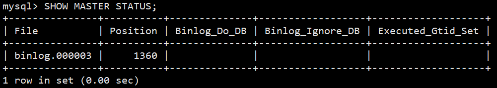
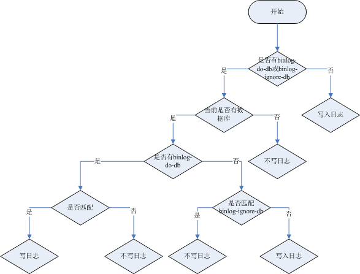
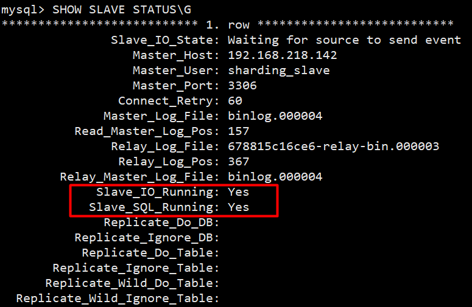

# proxy
## Docker
```shell
yum install -y yum-utils device-mapper-persistent-data  lvm2
yum-config-manager --add-repo http://mirrors.aliyun.com/docker-ce/linux/centos/docker-ce.repo
yum install -y docker-ce
systemctl start docker
docker version
```
```shell
#查看服务是否自动启动（是：enabled | 否：disabled）
systemctl list-unit-files|grep docker.service 

#设置开机启动：如不是enabled可以运行如下命令设置自启动
systemctl enable docker
#重新加载服务配置
systemctl daemon-reload 
```
```shell
如果此时防火墙是开启的，`则先关闭防火墙，并重启docker`，否则后续安装的MySQL无法启动

#关闭docker
systemctl stop docker
#关闭防火墙
systemctl stop firewalld
#启动docker
systemctl start docker
```
## Docker安装ShardingSphere-Proxy
### 安装
```yaml
docker run -d \
    -v /sharding/server/proxy/conf:/opt/shardingsphere-proxy/conf \
    -v /sharding/server/proxy/ext-lib:/opt/shardingsphere-proxy/ext-lib \
    -v /sharding/server/proxy/logs:/opt/shardingsphere-proxy/logs \
    -e PORT=3308 -p13308:3308 --name server-proxy apache/shardingsphere-proxy:5.4.0
```
MySQL驱动上传至`/sharding/server/proxy/ext-lib`目录
### **server.yaml**
```yaml
authority:
  users:
    - user: root@%
      password: 123456
  privilege:
    type: ALL_PERMITTED

props:
  sql-show: false
```
将配置文件上传至`/sharding/server/proxy/conf`目录
### **重启容器**
```shell
docker restart server-proxy
```
## 读写分离
### MySQL 主服务器
```shell
docker run -d \
-p 3306:3306 \
-v /sharding/mysql/master/conf:/etc/mysql/conf.d \
-v /sharding/mysql/master/data:/var/lib/mysql \
-e MYSQL_ROOT_PASSWORD=123456 \
--name sharding-mysql-master \
mysql:8.0.29
```
```shell
vim /sharding/mysql/master/conf/my.cnf

# --- 文件里面内容开始 ---
[mysqld]
# 服务器唯一id，默认值1
server-id=1
# 设置日志格式，默认值ROW
binlog_format=ROW
# --- 文件里面内容结束 ---

docker restart sharding-mysql-master
```
```shell
#进入容器：env LANG=C.UTF-8 避免容器中显示中文乱码
docker exec -it sharding-mysql-master env LANG=C.UTF-8 /bin/bash
#进入容器内的mysql命令行
mysql -uroot -p

# mysql5.7 的默认密码校验方式是 mysql_native_password
# mysql8.0 的默认密码校验方式是 caching_sha2_password
# 修改默认密码校验方式
ALTER USER 'root'@'%' IDENTIFIED WITH mysql_native_password BY '123456';
```
```sql
-- 创建slave用户
CREATE USER 'sharding_slave'@'%';
-- 设置密码
ALTER USER 'sharding_slave'@'%' IDENTIFIED WITH mysql_native_password BY '123456';
-- 授予复制权限
GRANT REPLICATION SLAVE ON *.* TO 'sharding_slave'@'%';
-- 刷新权限
FLUSH PRIVILEGES;
```
```sql
-- 查询master状态
SHOW MASTER STATUS;
```

> binlog.000003     1360

### MySQL my.cnf 参数解释
```powershell
[mysqld]
# 服务器唯一id，默认值1
server-id=1
# 设置日志格式，默认值ROW
binlog_format=STATEMENT
# 二进制日志名，默认binlog
# log-bin=binlog
# 设置需要复制的数据库，默认复制全部数据库
#binlog-do-db=mytestdb
# 设置不需要复制的数据库
#binlog-ignore-db=mysql
#binlog-ignore-db=infomation_schema
```
#### binlog格式说明

- binlog_format=STATEMENT：日志记录的是主机数据库的写指令，性能高，但是now()之类的函数以及获取系统参数的操作会出现主从数据不同步的问题。
- binlog_format=ROW（默认）：日志记录的是主机数据库的写后的数据，批量操作时性能较差，解决now()或者 user()或者 @@hostname 等操作在主从机器上不一致的问题。
- binlog_format=MIXED：是以上两种level的混合使用，有函数用ROW，没函数用STATEMENT，但是无法识别系统变量
#### binlog-ignore-db和binlog-do-db的优先级问题

### MySQL 从服务器1
```shell
docker run -d \
-p 3307:3306 \
-v /sharding/mysql/slave1/conf:/etc/mysql/conf.d \
-v /sharding/mysql/slave1/data:/var/lib/mysql \
-e MYSQL_ROOT_PASSWORD=123456 \
--name sharding-mysql-slave1 \
mysql:8.0.29
```
```shell
vim /sharding/mysql/slave1/conf/my.cnf

# --- 文件里面内容开始 ---
[mysqld]
# 服务器唯一id，每台服务器的id必须不同，如果配置其他从机，注意修改id
server-id=2
# 中继日志名，默认xxxxxxxxxxxx-relay-bin
#relay-log=relay-bin
# --- 文件里面内容结束 ---

docker restart sharding-mysql-slave1
```
```shell
#进入容器：
docker exec -it sharding-mysql-slave1 env LANG=C.UTF-8 /bin/bash
#进入容器内的mysql命令行
mysql -uroot -p
#修改默认密码校验方式
ALTER USER 'root'@'%' IDENTIFIED WITH mysql_native_password BY '123456';
```
```sql
--  MASTER IP
CHANGE MASTER TO MASTER_HOST='192.168.218.142', 
-- MASTER 中创建的slave用户
MASTER_USER='sharding_slave',MASTER_PASSWORD='123456', MASTER_PORT=3306,
-- MASTER 执行 SHOW MASTER STATUS; 获取
MASTER_LOG_FILE='binlog.000003',MASTER_LOG_POS=1360;
```
### MySQL 从服务器2
```shell
docker run -d \
-p 3308:3306 \
-v /sharding/mysql/slave2/conf:/etc/mysql/conf.d \
-v /sharding/mysql/slave2/data:/var/lib/mysql \
-e MYSQL_ROOT_PASSWORD=123456 \
--name sharding-mysql-slave2 \
mysql:8.0.29
```
```shell
vim /sharding/mysql/slave2/conf/my.cnf

# --- 文件里面内容开始 ---
[mysqld]
# 服务器唯一id，每台服务器的id必须不同，如果配置其他从机，注意修改id
server-id=3
# 中继日志名，默认xxxxxxxxxxxx-relay-bin
#relay-log=relay-bin
# --- 文件里面内容结束 ---

docker restart sharding-mysql-slave2
```
```shell
#进入容器：
docker exec -it sharding-mysql-slave2 env LANG=C.UTF-8 /bin/bash
#进入容器内的mysql命令行
mysql -uroot -p
#修改默认密码校验方式
ALTER USER 'root'@'%' IDENTIFIED WITH mysql_native_password BY '123456';
```
```sql
--  MASTER IP
CHANGE MASTER TO MASTER_HOST='192.168.218.142', 
-- MASTER 中创建的slave用户
MASTER_USER='sharding_slave',MASTER_PASSWORD='123456', MASTER_PORT=3306,
-- MASTER 执行 SHOW MASTER STATUS; 获取
MASTER_LOG_FILE='binlog.000003',MASTER_LOG_POS=1360;
```
### 启动主从同步
```sql
START SLAVE;
-- 查看状态（不需要分号） \G: 纵向输出
SHOW SLAVE STATUS\G
```

```sql
CREATE DATABASE db_user;
USE db_user;
CREATE TABLE t_user (
 id BIGINT AUTO_INCREMENT,
 uname VARCHAR(30),
 PRIMARY KEY (id)
);
INSERT INTO t_user(uname) VALUES('zhang3');
INSERT INTO t_user(uname) VALUES(@@hostname);
```
### YAML 配置文件
```yaml
databaseName: readwrite_splitting_db

dataSources:
  write_ds:
    url: jdbc:mysql://192.168.218.142:3306/db_user?serverTimezone=UTC&useSSL=false
    username: root
    password: 123456
    connectionTimeoutMilliseconds: 30000
    idleTimeoutMilliseconds: 60000
    maxLifetimeMilliseconds: 1800000
    maxPoolSize: 50
    minPoolSize: 1
  read_ds_0:
    url: jdbc:mysql://192.168.218.142:3307/db_user?serverTimezone=UTC&useSSL=false
    username: root
    password: 123456
    connectionTimeoutMilliseconds: 30000
    idleTimeoutMilliseconds: 60000
    maxLifetimeMilliseconds: 1800000
    maxPoolSize: 50
    minPoolSize: 1
  read_ds_1:
    url: jdbc:mysql://192.168.218.142:3308/db_user?serverTimezone=UTC&useSSL=false
    username: root
    password: 123456
    connectionTimeoutMilliseconds: 30000
    idleTimeoutMilliseconds: 60000
    maxLifetimeMilliseconds: 1800000
    maxPoolSize: 50
    minPoolSize: 1

rules:
- !READWRITE_SPLITTING
  dataSources:
    readwrite_ds:
      writeDataSourceName: write_ds
      readDataSourceNames:
        - read_ds_0
        - read_ds_1
      transactionalReadQueryStrategy: PRIMARY
      loadBalancerName: random
  loadBalancers:
    random:
      type: RANDOM
```
将配置文件`config-readwrite-splitting.yaml`上传至`/sharding/server/proxy/conf`目录
### **重启容器**
```shell
docker restart server-proxy
```
## 垂直分片
### MySQL 服务器
```shell
docker run -d \
-p 3301:3306 \
-v /sharding/server/user/conf:/etc/mysql/conf.d \
-v /sharding/server/user/data:/var/lib/mysql \
-e MYSQL_ROOT_PASSWORD=123456 \
--name server-user \
mysql:8.0.29
```
```shell
#进入容器：
docker exec -it server-user env LANG=C.UTF-8 /bin/bash
#进入容器内的mysql命令行
mysql -uroot -p
#修改默认密码插件
ALTER USER 'root'@'%' IDENTIFIED WITH mysql_native_password BY '123456';
```
```sql
CREATE DATABASE db_user;
USE db_user;
CREATE TABLE t_user (
 id BIGINT AUTO_INCREMENT,
 uname VARCHAR(30),
 PRIMARY KEY (id)
);
```
```shell
docker run -d \
-p 3302:3306 \
-v /sharding/server/order/conf:/etc/mysql/conf.d \
-v /sharding/server/order/data:/var/lib/mysql \
-e MYSQL_ROOT_PASSWORD=123456 \
--name server-order \
mysql:8.0.29
```
```shell
#进入容器：
docker exec -it server-order env LANG=C.UTF-8 /bin/bash
#进入容器内的mysql命令行
mysql -uroot -p
#修改默认密码插件
ALTER USER 'root'@'%' IDENTIFIED WITH mysql_native_password BY '123456';
```
```sql
CREATE DATABASE db_order;
USE db_order;
CREATE TABLE t_order (
  id BIGINT AUTO_INCREMENT,
  order_no VARCHAR(30),
  user_id BIGINT,
  amount DECIMAL(10,2),
  PRIMARY KEY(id) 
);
```
### YAML 配置文件
```yaml
databaseName: sharding_db

dataSources:
  server-user:
    url: jdbc:mysql://192.168.218.142:3301/db_user?serverTimezone=UTC&useSSL=false
    username: root
    password: 123456
    connectionTimeoutMilliseconds: 30000
    idleTimeoutMilliseconds: 60000
    maxLifetimeMilliseconds: 1800000
    maxPoolSize: 50
    minPoolSize: 1
  server-order:
    url: jdbc:mysql://192.168.218.142:3302/db_order?serverTimezone=UTC&useSSL=false
    username: root
    password: 123456
    connectionTimeoutMilliseconds: 30000
    idleTimeoutMilliseconds: 60000
    maxLifetimeMilliseconds: 1800000
    maxPoolSize: 50
    minPoolSize: 1

rules:
- !SHARDING
  tables:
    t_user:
      actualDataNodes: server-user.t_user
    t_order:
      actualDataNodes: server-order.t_order
```
将配置文件`config-vertical-sharding.yaml`上传至`/sharding/server/proxy/conf`目录
### **重启容器**
```shell
docker restart server-proxy
```
## 水平分片
### MySQL 服务器
```shell
docker run -d \
-p 3310:3306 \
-v /sharding/server/order0/conf:/etc/mysql/conf.d \
-v /sharding/server/order0/data:/var/lib/mysql \
-e MYSQL_ROOT_PASSWORD=123456 \
--name server-order0 \
mysql:8.0.29
```
```shell
#进入容器：
docker exec -it server-order0 env LANG=C.UTF-8 /bin/bash
#进入容器内的mysql命令行
mysql -uroot -p
#修改默认密码插件
ALTER USER 'root'@'%' IDENTIFIED WITH mysql_native_password BY '123456';
```
```sql
CREATE DATABASE db_order;
USE db_order;
CREATE TABLE t_order0 (
  id BIGINT,
  order_no VARCHAR(30),
  user_id BIGINT,
  amount DECIMAL(10,2),
  PRIMARY KEY(id) 
);
CREATE TABLE t_order1 (
  id BIGINT,
  order_no VARCHAR(30),
  user_id BIGINT,
  amount DECIMAL(10,2),
  PRIMARY KEY(id) 
);

CREATE TABLE t_order_item0(
    id BIGINT,
    order_no VARCHAR(30),
    user_id BIGINT,
    price DECIMAL(10,2),
    `count` INT,
    PRIMARY KEY(id)
);
CREATE TABLE t_order_item1(
    id BIGINT,
    order_no VARCHAR(30),
    user_id BIGINT,
    price DECIMAL(10,2),
    `count` INT,
    PRIMARY KEY(id)
);
```
```shell
docker run -d \
-p 3311:3306 \
-v /sharding/server/order1/conf:/etc/mysql/conf.d \
-v /sharding/server/order1/data:/var/lib/mysql \
-e MYSQL_ROOT_PASSWORD=123456 \
--name server-order1 \
mysql:8.0.29
```
```shell
#进入容器：
docker exec -it server-order1 env LANG=C.UTF-8 /bin/bash
#进入容器内的mysql命令行
mysql -uroot -p
#修改默认密码插件
ALTER USER 'root'@'%' IDENTIFIED WITH mysql_native_password BY '123456';
```
```sql
CREATE DATABASE db_order;
USE db_order;
CREATE TABLE t_order0 (
  id BIGINT,
  order_no VARCHAR(30),
  user_id BIGINT,
  amount DECIMAL(10,2),
  PRIMARY KEY(id) 
);
CREATE TABLE t_order1 (
  id BIGINT,
  order_no VARCHAR(30),
  user_id BIGINT,
  amount DECIMAL(10,2),
  PRIMARY KEY(id) 
);

CREATE TABLE t_order_item0(
    id BIGINT,
    order_no VARCHAR(30),
    user_id BIGINT,
    price DECIMAL(10,2),
    `count` INT,
    PRIMARY KEY(id)
);
CREATE TABLE t_order_item1(
    id BIGINT,
    order_no VARCHAR(30),
    user_id BIGINT,
    price DECIMAL(10,2),
    `count` INT,
    PRIMARY KEY(id)
);
```
### YAML 配置文件 (水平分片+关联表)
```yaml
databaseName: sharding_db

dataSources:
  server-user:
    url: jdbc:mysql://192.168.218.142:3301/db_user?serverTimezone=UTC&useSSL=false
    username: root
    password: 123456
    connectionTimeoutMilliseconds: 30000
    idleTimeoutMilliseconds: 60000
    maxLifetimeMilliseconds: 1800000
    maxPoolSize: 50
    minPoolSize: 1
  server-order0:
    url: jdbc:mysql://192.168.218.142:3310/db_order?serverTimezone=UTC&useSSL=false
    username: root
    password: 123456
    connectionTimeoutMilliseconds: 30000
    idleTimeoutMilliseconds: 60000
    maxLifetimeMilliseconds: 1800000
    maxPoolSize: 50
    minPoolSize: 1
  server-order1:
    url: jdbc:mysql://192.168.218.142:3311/db_order?serverTimezone=UTC&useSSL=false
    username: root
    password: 123456
    connectionTimeoutMilliseconds: 30000
    idleTimeoutMilliseconds: 60000
    maxLifetimeMilliseconds: 1800000
    maxPoolSize: 50
    minPoolSize: 1

rules:
- !SHARDING
  tables:
    t_user:
      actualDataNodes: server-user.t_user
    t_order:
      actualDataNodes: server-order${0..1}.t_order${0..1}
      # 分库策略
      databaseStrategy:
        standard:
          # 分片列名称
          shardingColumn: user_id
          # 分片算法名称
          shardingAlgorithmName: alg_database_inline_userid
      # 分表策略
      tableStrategy:
        standard:
          shardingColumn: order_no
          shardingAlgorithmName: alg_order_inline_order_no
      # 分布式序列策略
      keyGenerateStrategy:
        # 自增列名称
        column: id
        # 分布式序列算法名称
        keyGeneratorName: alg_snowflake
    t_order_item:
      actualDataNodes: server-order${0..1}.t_order_item${0..1}
      databaseStrategy:
        standard:
          shardingColumn: user_id
          shardingAlgorithmName: alg_database_inline_userid
      tableStrategy:
        standard:
          shardingColumn: order_no
          shardingAlgorithmName: alg_order_item_inline_order_no
      keyGenerateStrategy:
        column: id
        keyGeneratorName: alg_snowflake
  # 分片算法配置
  shardingAlgorithms:
    # 分片算法名称
    alg_database_inline_userid:
      # 分片算法类型
      type: INLINE
      # 分片算法属性配置
      props:
        algorithm-expression: server-order${user_id % 2}
    alg_order_inline_order_no:
      type: INLINE
      props:
        algorithm-expression: t_order${(order_no - 'DINGDANHAO').toInteger() % 2}
    alg_order_item_inline_order_no:
      type: INLINE
      props:
        algorithm-expression: t_order_item${(order_no - 'DINGDANHAO').toInteger() % 2}
  # 分布式序列算法配置
  keyGenerators:
    # 分布式序列算法名称
    alg_snowflake:
      # 分布式序列算法类型
      type: SNOWFLAKE

  # 绑定表规则列表
  bindingTables:
    - t_order,t_order_item

```
将配置文件`config-horizontal-sharding.yaml`上传至`/sharding/server/proxy/conf`目录
### **重启容器**
```shell
docker restart server-proxy
```
### 广播表
```sql
-- server-order0、server-order1、server-user 服务器中分别创建 t_dict 表
CREATE TABLE t_dict(
    id BIGINT,
    dict_type VARCHAR(200),
    PRIMARY KEY(id)
);
```
#### YAML 配置文件
```yaml
rules:
- !BROADCAST
  tables: # 广播表规则列表
    - t_dict
```
